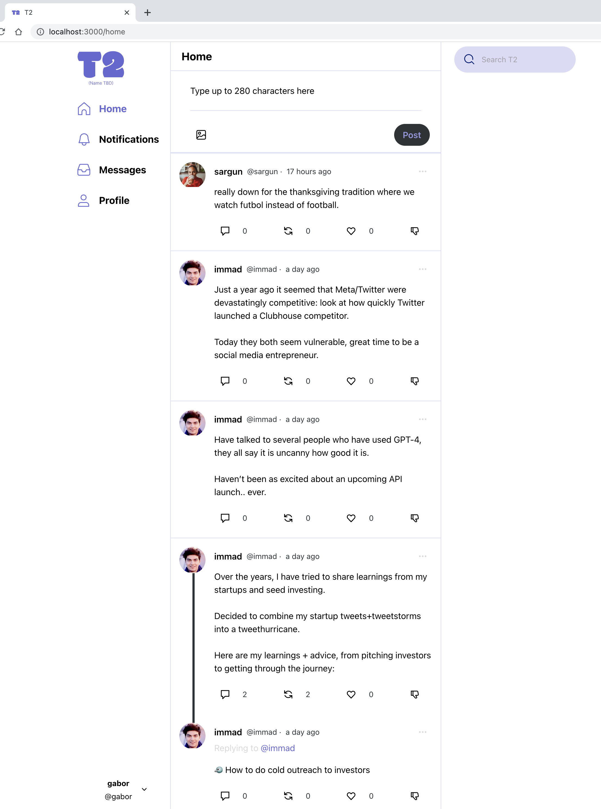

<h1>T2</h1>

The new public square

---

# Preview

# Developer instructions

## Git Workflow

- Create your feature or hotfix branch followed by a descriptive yet simple and concise name, see examples belog:

  `feature/signup`
  `hotfix/signup-email-error`

- Once you complete your work push your branch and create a Pull Request to the `develop` branch.

- Never push to `develop` or `main` branches directly.

## Cloud Deployment (Informational Only)

- The server will deploy automatically when the `develop` or `main` branches are updated, deploying to `beta.t2.social` and `t2.social` respectively
  - Server is running on an EC2 instance directly (no docker)
  - The front end is behind a nginx site
  - The backend is behind an nginx proxy configuration to enable SSL and proper communication with the front end
- In the future we will set up a completely different workflow and architecture using Amazon ECS similar to: https://www.docker.com/blog/docker-compose-from-local-to-amazon-ecs/

# Linear task list

The task list and task assignments are in [this Linear.app list](https://linear.app/townsquare/team/T2/active). Please request access if you don't have it.

# How to run

Check [here](RUNNING_LOCALLY.md) on how to run locally
